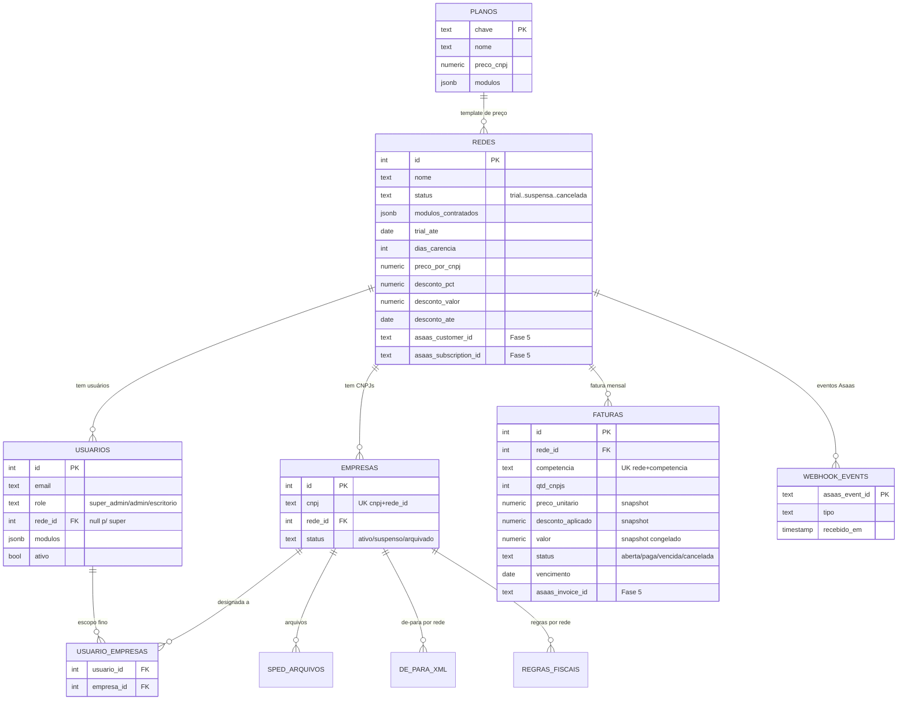
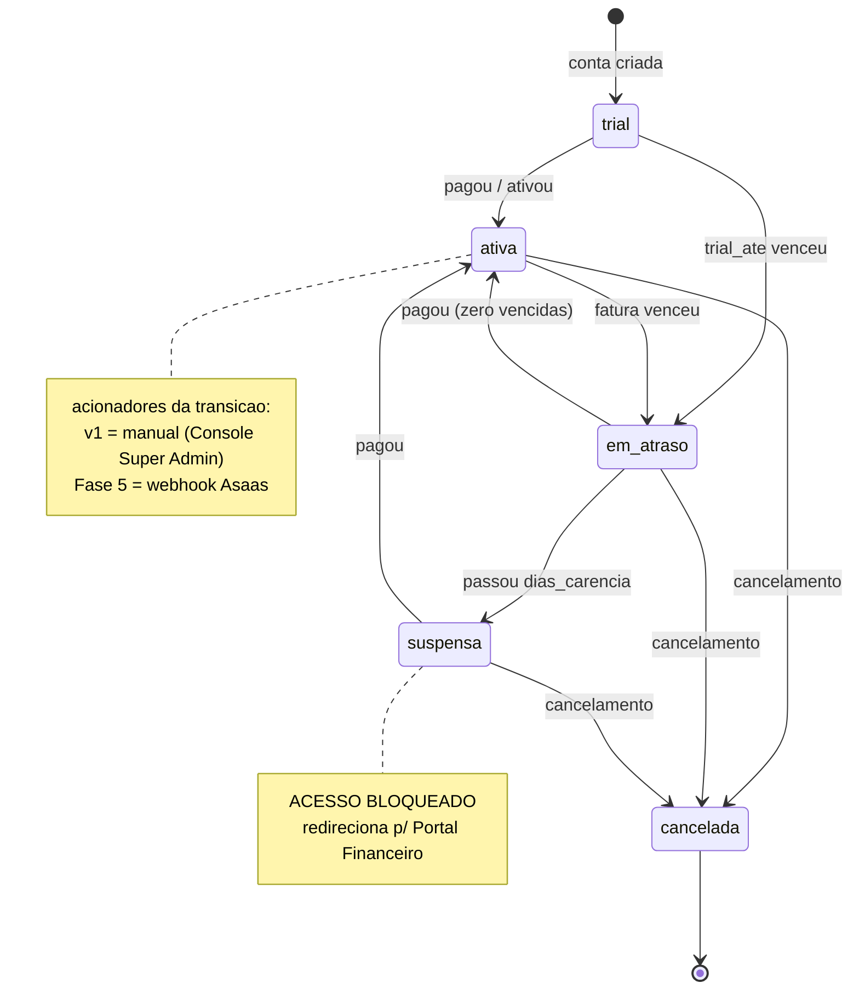
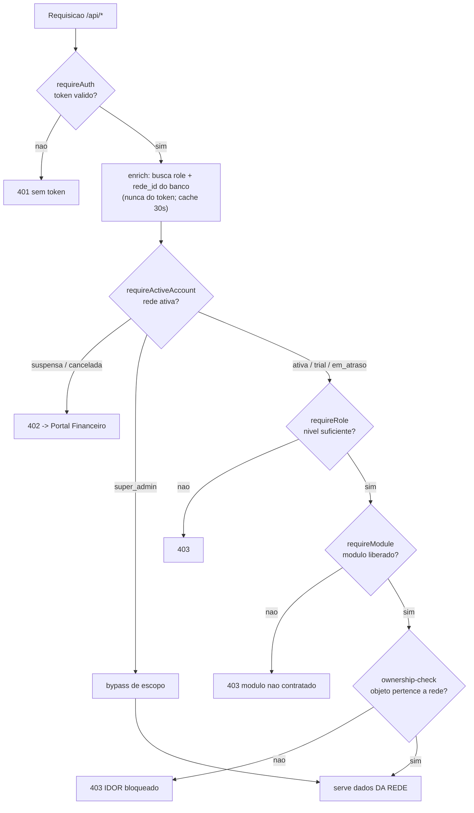
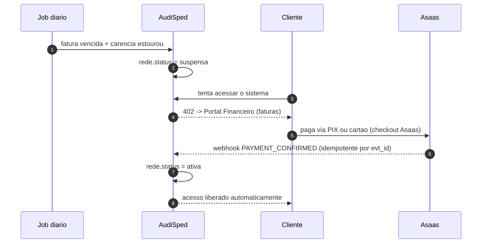

/# Diagramas — Controle de Usuários & SaaS (AudiSped)

> Companheiro visual do `PLANO_CONTROLE_USUARIOS_SAAS.md`.
> **Como ver:** abra o **preview de Markdown** do IDE (ou abra este arquivo no GitHub) — os blocos `mermaid` renderizam automaticamente. Zero instalação.

---

## 1. Modelo de dados (ER) — núcleo SaaS

> ⚠️ **REVISTO (§13.1 do plano):** só `de_para_xml` ganha `rede_id` (per-tenant). **`regras_fiscais` fica GLOBAL** (motor do export; per-tenant regride o SPED aos valores crus do XML). `cad_cfops`/`ncm`/`cest`/catálogo seguem globais (read-only).

---

## 2. Máquina de estados de acesso / cobrança

---

## 3. Cadeia de autorização no backend (por requisição)

> O **ownership-check** (não só filtro de lista) é o achado crítico §12.1 — vale em toda rota com `:id`.

---

## 4. Fluxo de cobrança automática (Fase 5 — Asaas)

---

*Editar estes diagramas: pode ajustar o Mermaid direto aqui (texto), ou — se um dia instalar a extensão draw.io — exportar para `.drawio`. Por enquanto, render automático no preview do Markdown.*
